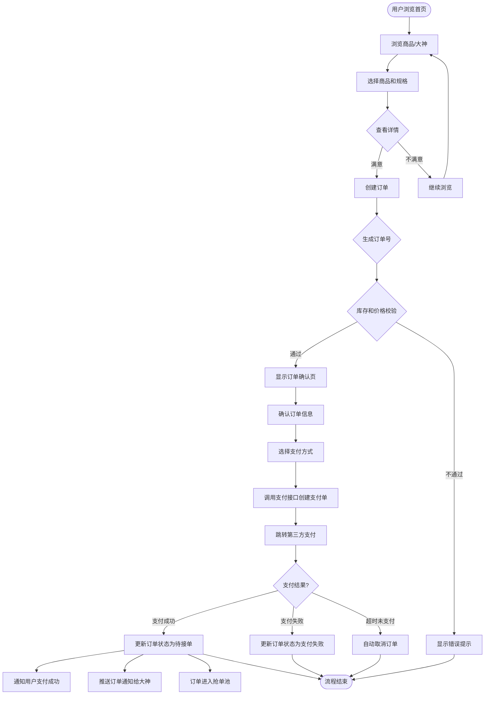
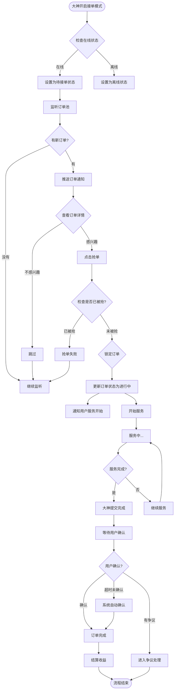
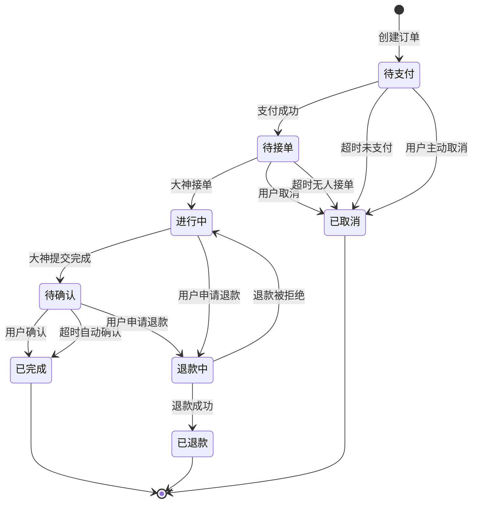
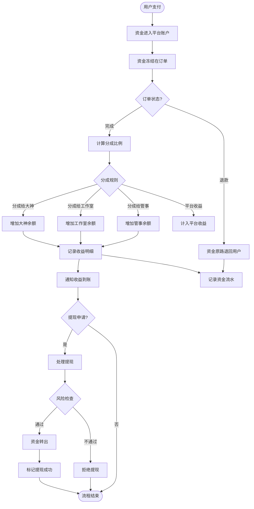
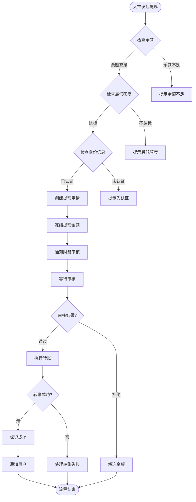
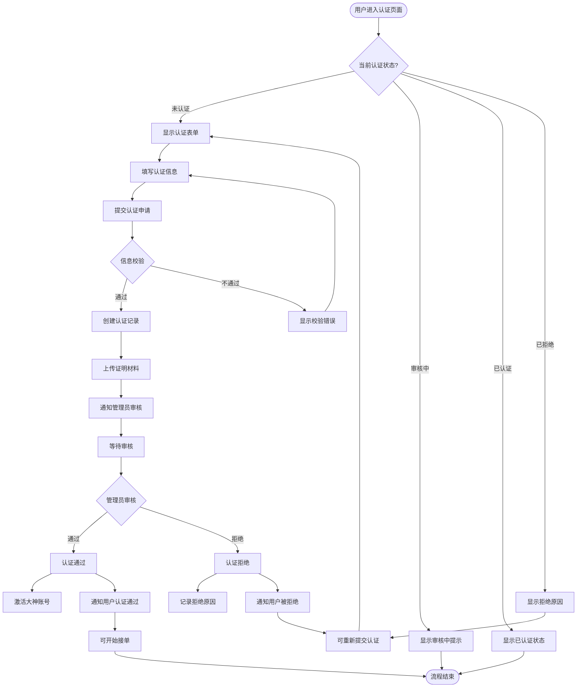
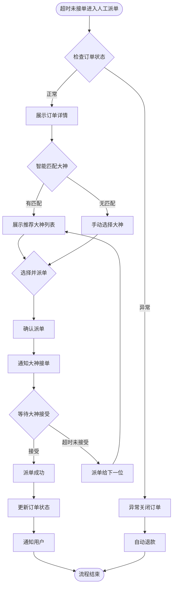
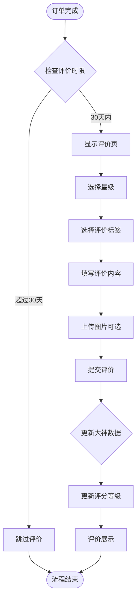
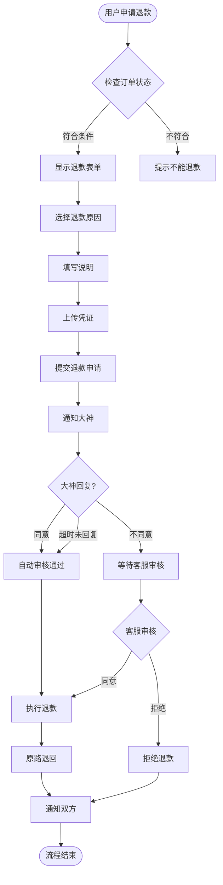

# 电竞陪玩护航系统 - 业务流程图文档

## 概述

本文档详细描述电竞陪玩护航系统的核心业务流程，包括用户下单流程、大神接单流程、订单状态流转、资金结算流程、认证审核流程等关键业务流程，帮助开发团队和产品团队理解完整的业务逻辑。

---

## 一、用户下单支付流程

### 1.1 完整流程图

### 1.2 详细步骤说明

| 步骤 | 节点名称 | 触发条件 | 系统处理 | 用户操作 | 备注 |
|------|----------|----------|----------|----------|------|
| 1 | 用户浏览首页 | 用户打开APP/小程序 | 加载首页数据、推荐商品、热门分类 | 浏览内容 | - |
| 2 | 选择商品和规格 | 用户点击商品 | 展示商品详情、价格、规格选项 | 选择规格、数量 | 支持多种规格选择 |
| 3 | 创建订单 | 用户点击立即下单 | 验证用户登录状态、商品状态 | 提交订单请求 | 生成唯一订单号 |
| 4 | 库存和价格校验 | 提交订单时 | 检查商品库存、实时价格校验 | 等待结果 | 防止超卖 |
| 5 | 显示订单确认页 | 校验通过 | 展示订单信息、价格明细、服务说明 | 核对订单信息 | - |
| 6 | 选择支付方式 | 确认订单后 | 支持微信支付、支付宝、余额支付 | 选择支付方式 | 保存用户偏好 |
| 7 | 跳转第三方支付 | 点击支付 | 调用支付接口，跳转微信/支付宝 | 完成支付 | 保存支付单信息 |
| 8 | 支付结果回调 | 第三方支付通知 | 验证回调数据，更新订单状态 | 等待结果 | 异步回调处理 |
| 9 | 通知用户 | 支付成功 | 发送站内信、推送、短信通知 | 查看通知 | 多渠道通知 |
| 10 | 推送订单给大神 | 支付成功 | 将订单加入抢单池，推送通知 | 等待抢单 | 支持自动派单 |

### 1.3 异常处理分支

| 异常场景 | 处理方式 | 用户提示 |
|----------|----------|----------|
| 商品已下架 | 跳回商品列表 | "抱歉，该商品已下架" |
| 库存不足 | 提示库存不足 | "库存不足，请选择其他规格" |
| 价格变动 | 提示用户确认 | "商品价格已变动，请确认" |
| 余额不足 | 提示充值 | "余额不足，请先充值" |
| 网络超时 | 显示重试按钮 | "网络超时，请稍后重试" |

---

## 二、大神抢单服务流程

### 2.1 完整流程图

### 2.2 详细步骤说明

| 步骤 | 节点名称 | 触发条件 | 系统处理 | 大神操作 | 备注 |
|------|----------|----------|----------|----------|------|
| 1 | 开启接单模式 | 大神开启APP | 检查认证状态、账号状态 | 切换接单开关 | 仅已认证大神可接单 |
| 2 | 监听订单池 | 在线状态 | 订阅新订单WebSocket消息 | 等待通知 | 实时推送 |
| 3 | 推送订单通知 | 有新订单 | 推送弹窗通知、声音提示 | 查看通知 | 可设置免打扰 |
| 4 | 查看订单详情 | 点击通知 | 展示订单信息、价格、用户要求 | 查看详情 | 展示预计收益 |
| 5 | 抢单 | 点击抢单 | 检查订单是否已被抢，锁定订单 | 快速操作 | 防止重复抢单 |
| 6 | 锁定订单 | 抢单成功 | 更新订单状态，关联大神ID | - | 使用数据库乐观锁 |
| 7 | 通知用户 | 锁定成功 | 通知用户已接单、大神信息 | - | 支持IM沟通 |
| 8 | 开始服务 | 接单成功 | 双方进入聊天，开始服务 | 提供服务 | - |
| 9 | 提交完成 | 服务结束 | 提交服务完成，上传凭证 | 提交完成 | 可附加图片 |
| 10 | 用户确认 | 收到提交 | 发送通知给用户确认 | 用户确认 | 24小时超时自动确认 |
| 11 | 结算收益 | 订单完成 | 计算分成，增加大神余额 | 收益到账 | 支持实时或定时结算 |

### 2.3 抢单池规则

| 规则项 | 说明 |
|--------|------|
| 订单可见范围 | 同一游戏分类、符合大神服务范围 |
| 抢单超时 | 订单发布30分钟无人接单，自动进入人工派单 |
| 抢单限制 | 同一订单只能抢一次，成功抢到后不可再抢 |
| 信誉优先 | 大神信誉分高者，相同时间抢单优先 |
| 在线优先级 | 在线大神优先看到新订单推送 |

---

## 三、订单状态流转流程

### 3.1 完整状态流转图

### 3.2 状态定义表

| 状态值 | 状态名称 | 英文标识 | 说明 | 超时时间 | 可执行操作 |
|--------|----------|----------|------|----------|------------|
| 0 | 待支付 | PENDING_PAY | 用户已创建订单，未支付 | 30分钟 | 支付、取消 |
| 1 | 待接单 | PENDING_ACCEPT | 已支付，等待大神接单 | 30分钟 | 取消、联系客服 |
| 2 | 进行中 | IN_PROGRESS | 大神已接单，服务中 | 不限 | 联系、申请退款 |
| 3 | 待确认 | PENDING_CONFIRM | 服务完成，等待用户确认 | 24小时 | 确认、申请退款 |
| 4 | 退款中 | REFUNDING | 用户申请退款，处理中 | 7天 | 等待处理 |
| 5 | 已退款 | REFUNDED | 退款成功，订单结束 | - | 查看详情 |
| 6 | 已取消 | CANCELLED | 订单已取消 | - | 查看详情 |
| 7 | 已完成 | COMPLETED | 订单完成，交易结束 | - | 评价、查看 |

### 3.3 状态触发条件

| 当前状态 | 目标状态 | 触发条件 | 触发方 |
|----------|----------|----------|--------|
| 待支付 | 待接单 | 用户成功支付 | 用户 |
| 待支付 | 已取消 | 支付超时（30分钟） | 系统 |
| 待支付 | 已取消 | 用户主动取消 | 用户 |
| 待接单 | 进行中 | 大神抢单成功 | 大神 |
| 待接单 | 已取消 | 超时无人接单（30分钟） | 系统 |
| 待接单 | 已取消 | 用户取消 | 用户 |
| 进行中 | 待确认 | 大神提交服务完成 | 大神 |
| 进行中 | 退款中 | 用户申请退款 | 用户 |
| 待确认 | 已完成 | 用户确认完成 | 用户 |
| 待确认 | 已完成 | 超时自动确认（24小时） | 系统 |
| 待确认 | 退款中 | 用户申请退款 | 用户 |
| 退款中 | 已退款 | 退款审核通过 | 客服/系统 |
| 退款中 | 进行中 | 退款审核拒绝 | 客服 |

### 3.4 状态流转事件表

| 事件类型 | 事件说明 | 通知对象 |
|----------|----------|----------|
| 订单创建 | 用户创建订单 | 用户 |
| 支付成功 | 用户完成支付 | 用户、大神、客服 |
| 订单取消 | 订单被取消 | 用户（如已支付通知退款） |
| 大神接单 | 大神成功接单 | 用户、大神 |
| 服务完成 | 大神提交完成 | 用户 |
| 订单完成 | 用户确认完成 | 用户、大神 |
| 退款申请 | 用户申请退款 | 大神、客服 |
| 退款完成 | 退款成功 | 用户、大神 |

---

## 四、资金结算流程

### 4.1 完整资金流程图

### 4.2 分成比例规则

| 角色 | 分成比例 | 说明 |
|------|----------|------|
| 大神 | 70% | 直接服务提供者 |
| 工作室 | 5% | 仅当大神隶属于工作室时 |
| 管事 | 2% | 仅当有神父邀请关系时 |
| 平台 | 23% | 平台服务费用 |

### 4.3 资金结算详细步骤

| 步骤 | 操作 | 说明 | 资金流向 |
|------|------|------|----------|
| 1 | 用户支付 | 订单支付成功 | 用户 → 平台账户 |
| 2 | 资金冻结 | 订单金额冻结 | 平台冻结账户 |
| 3 | 订单完成 | 用户确认服务完成 | 解锁资金 |
| 4 | 分成计算 | 根据规则计算各方收益 | 计算各角色金额 |
| 5 | 分录入账 | 各角色余额增加 | 大神/工作室/管事 → 可提现余额 |
| 6 | 收益记录 | 记录每笔收益明细 | 生成收入记录 |
| 7 | 通知推送 | 推送收益到账通知 | - |

### 4.4 提现流程说明

**提现规则说明：**

| 规则项 | 说明 |
|--------|------|
| 最低提现额 | 10元 |
| 提现手续费 | 无手续费 |
| 提现到账 | 1-3个工作日 |
| 每日限额 | 单日最多提现3次 |
| 支持渠道 | 微信零钱、支付宝、银行卡 |

---

## 五、认证审核流程

### 5.1 大神认证完整流程图

### 5.2 认证信息要求

| 资料项 | 必填 | 说明 |
|--------|------|------|
| 真实姓名 | ✅ | 与身份证一致 |
| 身份证号 | ✅ | 18位有效身份证 |
| 身份证照片 | ✅ | 正反面两张 |
| 手持身份证照片 | ✅ | 本人手持身份证 |
| 擅长游戏 | ✅ | 至少选择一个 |
| 服务介绍 | ✅ | 100-500字 |
| 展示图片 | ✅ | 最多6张展示作品 |
| 联系方式 | ✅ | 手机号验证 |

### 5.3 审核标准

| 审核项 | 合格标准 | 常见拒绝原因 |
|--------|----------|--------------|
| 身份信息 | 身份证真实有效、本人信息 | 身份证过期、信息不符 |
| 照片质量 | 清晰可识别、无遮挡、无PS | 模糊、反光、遮挡、拼接 |
| 游戏资质 | 有相应游戏水平证明 | 无实力证明、资料不足 |
| 服务介绍 | 详细具体、有服务承诺 | 内容简短、敷衍、违规内容 |

### 5.4 认证状态流转

| 状态 | 说明 | 可操作 |
|------|------|--------|
| 未认证 | 尚未提交认证申请 | 提交认证 |
| 审核中 | 管理员正在审核 | 等待结果、取消申请 |
| 已认证 | 认证通过，正常接单 | 接单服务 |
| 已拒绝 | 认证未通过 | 修改后重新提交 |

---

## 六、客服派单处理流程

### 6.1 人工派单流程图

### 6.2 人工派单规则

| 规则项 | 说明 |
|--------|------|
| 触发条件 | 订单30分钟无人接单 |
| 推荐规则 | 在线大神优先、同游戏分类、历史表现好、距离近 |
| 派单限制 | 同一订单最多连续派单5次，如全部拒绝则退款处理 |
| 超时时间 | 每次派单等待3分钟，超时自动派给下一位 |

---

## 七、评价系统流程

### 7.1 评价流程图

### 7.2 评价规则

| 规则项 | 说明 |
|--------|------|
| 评价时限 | 订单完成后30天内可评价 |
| 评价星级 | 1-5星，必填 |
| 评价内容 | 10-500字，必填 |
| 评价标签 | 可选3个预设标签 |
| 评价图片 | 最多上传3张 |
| 修改评价 | 15天内可修改一次 |

---

## 八、退款处理流程

### 8.1 退款申请处理流程图

### 8.2 退款政策

| 订单状态 | 可退款条件 | 退款比例 |
|----------|------------|----------|
| 待接单 | 随时可退 | 100% |
| 进行中 | 服务前可退，服务中协商 | 按服务进度协商 |
| 待确认 | 可申请争议退款 | 客服判定 |
| 已完成 | 有争议可申请售后 | 根据情况判定 |

---

*文档版本：v1.0*  
*创建日期：2026-05-21*  
*最后更新：2026-05-21*
