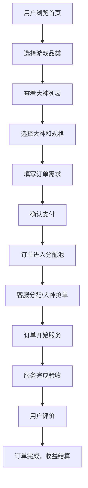
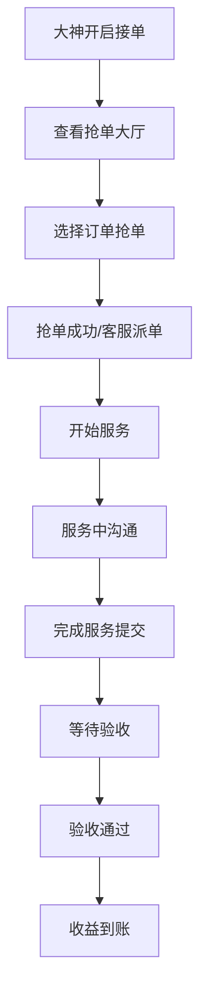
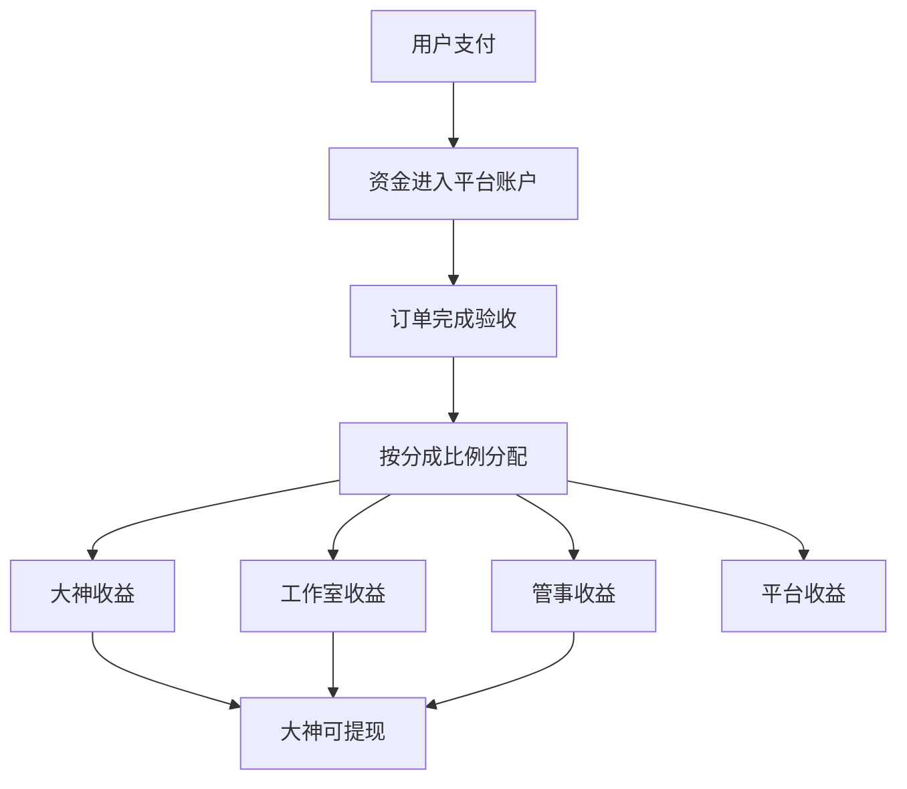
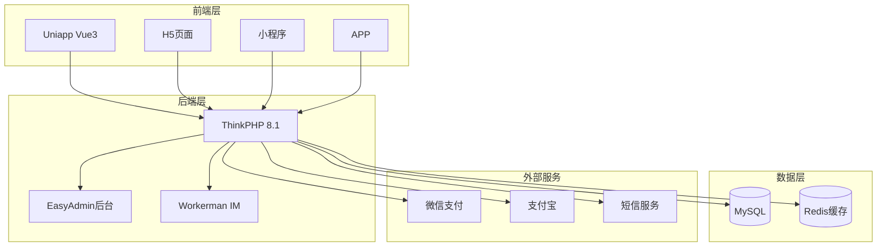
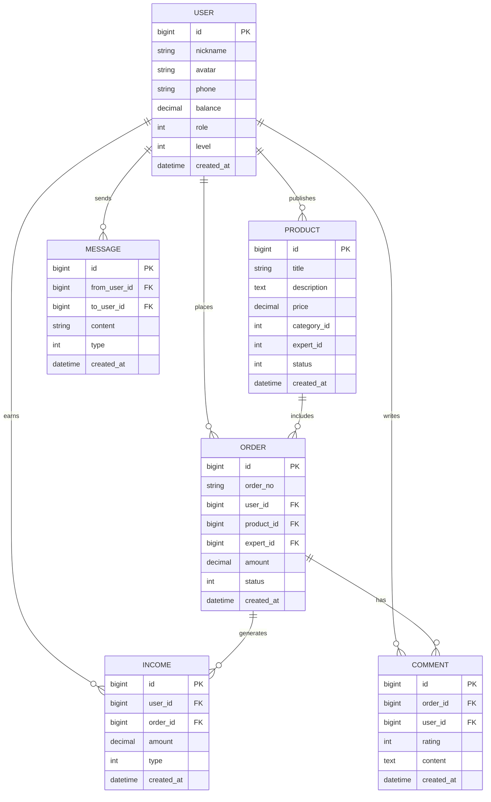

# 电竞陪玩护航系统 - PRD文档

## 1. 产品概述

一站式电竞陪玩护航平台，解决传统派单靠人工、结算靠表格、退款全靠手动的痛点问题。为用户提供游戏陪玩服务，为大神/打手提供接单平台，支持普通单和车队单双模式。

### 1.1 核心价值
- 全流程自动化：派单、结算、退款规则化，减少人工介入
- 多角色协同：用户、大神、工作室、管事、客服五端协同
- 智能运营：分佣风控、DIY页面、会员体系等运营工具
- 商业闭环：支付、财务、提现完整的资金链路

---

## 2. 核心功能

### 2.1 用户角色

| 角色 | 注册方式 | 核心权限 |
|------|----------|----------|
| 用户(老板) | 手机号/微信/QQ注册 | 下单、支付、评价、退款、充值 |
| 大神(打手) | 手机号/微信/QQ注册，需认证 | 接单、抢单、收益查看、提现 |
| 工作室 | 手机号/微信/QQ注册，需认证 | 管理打手、设置分成、查看收益 |
| 管事 | 手机号/微信/QQ注册，需认证 | 邀请打手、获取邀请收益 |
| 客服 | 管理员后台创建 | 派单、验收订单、处理退款 |
| 平台管理员 | 管理员后台创建 | 系统配置、数据看板、财务管理 |

### 2.2 功能模块

1. **首页大厅**: 英雄区、游戏分类、推荐大神、订单播报
2. **商品详情**: 商品信息、规格选择、价格展示、下单入口
3. **订单中心**: 订单列表、订单详情、订单操作
4. **大神端**: 抢单大厅、收益中心、个人主页、保证金管理
5. **工作室端**: 打手管理、分成设置、收益统计
6. **管事端**: 邀请管理、邀请收益
7. **客服端**: 派单管理、订单验收、退款处理
8. **总控后台**: 数据看板、商品管理、会员管理、财务统计
9. **个人中心**: 钱包、充值、评价、设置
10. **IM通讯**: 聊天、动态广场、系统消息

### 2.3 页面详情

| 页面名称 | 模块名称 | 功能描述 |
|---------|---------|---------|
| 首页大厅 | 英雄区 | 轮播图、弹窗广告、公告通知 |
| 首页大厅 | 游戏分类 | 游戏品类入口，支持大区/服务器筛选 |
| 首页大厅 | 推荐大神 | 按等级、评分、价格推荐大神 |
| 首页大厅 | 订单播报 | 滚动展示最近成交订单 |
| 商品详情 | 商品信息 | 商品介绍、价格、规格选择 |
| 商品详情 | 下单入口 | 立即下单、需求发布 |
| 订单中心 | 订单列表 | 全部订单、待支付、进行中、已完成、退款中 |
| 订单中心 | 订单详情 | 订单信息、服务进度、评价入口 |
| 大神端 | 抢单大厅 | 可抢订单列表、抢单操作 |
| 大神端 | 收益中心 | 收益明细、提现、充值 |
| 大神端 | 个人主页 | 等级、认证信息、动态、评价 |
| 大神端 | 保证金管理 | 保证金余额、缴纳、扣缴记录 |
| 工作室端 | 打手管理 | 邀请打手、管理打手、查看打手数据 |
| 工作室端 | 分成设置 | 设置打手分成比例 |
| 管事端 | 邀请管理 | 邀请码生成、邀请记录 |
| 管事端 | 邀请收益 | 邀请收益明细 |
| 客服端 | 派单管理 | 订单分配池、手动派单 |
| 客服端 | 订单验收 | 订单验收、强制结算 |
| 客服端 | 退款处理 | 退款申请审核 |
| 总控后台 | 数据看板 | GMV、订单量、用户增长、收益统计 |
| 总控后台 | 商品管理 | 商品发布、分类管理、区服管理 |
| 总控后台 | 会员管理 | 用户会员、打手会员配置 |
| 总控后台 | 财务统计 | 资金流水、提现管理 |
| 个人中心 | 钱包管理 | 余额、充值、消费记录 |
| 个人中心 | 我的评价 | 已发表评价、待评价订单 |
| IM通讯 | 聊天窗口 | 文字、图片消息 |
| IM通讯 | 动态广场 | 动态发布、点赞、评论、关注 |
| IM通讯 | 消息中心 | 系统通知、订单通知 |

---

## 3. 核心流程

### 3.1 用户下单流程



### 3.2 大神接单流程



### 3.3 资金流转流程



---

## 4. 用户界面设计

### 4.1 设计风格

- **主色调**: 紫色/蓝色渐变 (#6366f1, #8b5cf6) - 电竞科技感
- **辅助色**: 绿色 (#10b981) - 成功/在线；橙色 (#f59e0b) - 警告；红色 (#ef4444) - 错误
- **按钮风格**: 圆角 (12px)，渐变填充，悬停上浮效果
- **字体**: 系统默认字体，标题 18-24px，正文 14-16px
- **布局风格**: 卡片式布局，模块分明，圆角设计
- **图标风格**: 线性图标，简洁现代，统一24x24px尺寸
- **表情/emoji**: 🎮 ⚡ 💰 🔥 🏆 等电竞相关表情

### 4.2 页面设计概览

| 页面名称 | 模块名称 | UI元素 |
|---------|---------|--------|
| 首页大厅 | 英雄区 | 渐变背景、轮播动画、弹窗广告 |
| 首页大厅 | 游戏分类 | 图标+文字网格、卡片式、选中高亮 |
| 首页大厅 | 推荐大神 | 头像+等级+价格、横向滚动 |
| 商品详情 | 商品信息 | 大图轮播、规格标签、价格展示 |
| 商品详情 | 下单入口 | 底部悬浮按钮、价格醒目展示 |
| 订单中心 | 订单列表 | 时间线状态、卡片式、操作按钮 |
| 大神端 | 抢单大厅 | 订单卡片、价格突出、一键抢单 |
| 大神端 | 收益中心 | 数字大字体、图表统计、操作按钮 |
| 总控后台 | 数据看板 | 图表组件、卡片统计、实时更新 |
| IM通讯 | 聊天窗口 | 气泡对话、头像展示、输入框 |

### 4.3 响应式设计

- **移动端优先设计**: 针对小程序和H5优化
- **适配设备**: 手机 (375px)、平板 (768px)、桌面 (1440px)
- **触摸优化**: 按钮最小 44x44px，间距舒适
- **导航模式**: 底部Tab栏 (移动端)，侧边栏 (桌面端)

---

## 5. 技术架构

### 5.1 整体架构



### 5.2 技术栈说明

| 层级 | 技术选型 | 说明 |
|------|---------|------|
| 后端框架 | ThinkPHP 8.1 | 国内主流PHP框架，生态成熟 |
| 后台管理 | EasyAdmin | 权限、菜单、CRUD开箱即用 |
| 通讯引擎 | Workerman | 常驻内存异步框架，IM消息延迟<50ms |
| 前端框架 | Uniapp (Vue3) | 一套代码编译小程序+H5+APP |
| 数据库 | MySQL 8.0+ | 关系型数据库，支持事务 |
| 缓存 | Redis | 缓存、会话、队列 |
| 服务器环境 | Linux + Nginx | 主流生产环境，宝塔一键部署 |

### 5.3 目录结构

```
/
├── server/                 # 后端代码
│   ├── app/               # 应用目录
│   │   ├── controller/    # 控制器
│   │   ├── model/         # 模型
│   │   ├── service/       # 业务逻辑层
│   │   └── validate/      # 验证器
│   ├── config/            # 配置文件
│   ├── route/             # 路由定义
│   └── public/            # 公共目录
├── client/                # 前端代码
│   ├── pages/             # 页面
│   ├── components/        # 组件
│   ├── api/               # API接口
│   └── store/             # 状态管理
└── im/                    # IM服务
    └── workerman/         # Workerman服务
```

---

## 6. API接口规范

### 6.1 接口返回格式

```typescript
interface ApiResponse<T = any> {
  code: number;           // 状态码，200成功
  message: string;        // 提示信息
  data: T;                // 返回数据
  timestamp: number;      // 时间戳
}
```

### 6.2 核心接口定义

#### 6.2.1 用户模块

```typescript
// 用户登录
POST /api/user/login
Request: {
  phone: string;
  code: string;
}
Response: {
  token: string;
  userInfo: UserInfo;
}

// 获取用户信息
GET /api/user/info
Response: {
  id: number;
  nickname: string;
  avatar: string;
  balance: number;
  role: 'user' | 'expert' | 'studio' | 'manager';
}

// 充值
POST /api/user/recharge
Request: {
  amount: number;
  payType: 'wechat' | 'alipay';
}
Response: {
  orderNo: string;
  payUrl: string;
}
```

#### 6.2.2 商品模块

```typescript
// 获取商品列表
GET /api/product/list
Query: {
  categoryId?: number;
  page?: number;
  pageSize?: number;
}
Response: {
  list: Product[];
  total: number;
}

// 获取商品详情
GET /api/product/detail/:id
Response: Product;
```

#### 6.2.3 订单模块

```typescript
// 创建订单
POST /api/order/create
Request: {
  productId: number;
  specId: number;
  expertId?: number;
  remark?: string;
}
Response: {
  orderNo: string;
  amount: number;
}

// 订单列表
GET /api/order/list
Query: {
  status?: string;
  page?: number;
}
Response: {
  list: Order[];
  total: number;
}

// 订单详情
GET /api/order/detail/:id
Response: Order;

// 支付订单
POST /api/order/pay
Request: {
  orderNo: string;
  payType: 'wechat' | 'alipay' | 'balance';
}
Response: {
  payUrl?: string;
}
```

#### 6.2.4 大神模块

```typescript
// 抢单大厅
GET /api/expert/orders
Query: {
  categoryId?: number;
}
Response: Order[];

// 抢单
POST /api/expert/grab
Request: {
  orderId: number;
}
Response: {
  success: boolean;
}

// 收益明细
GET /api/expert/income
Query: {
  page?: number;
}
Response: {
  list: IncomeRecord[];
  total: number;
}
```

#### 6.2.5 IM模块

```typescript
// 发送消息
POST /api/im/send
Request: {
  toUserId: number;
  type: 'text' | 'image';
  content: string;
}
Response: {
  messageId: string;
}

// 获取消息记录
GET /api/im/messages
Query: {
  userId: number;
  lastMsgId?: string;
}
Response: Message[];
```

---

## 7. 数据模型

### 7.1 ER图



### 7.2 核心表结构

```sql
-- 用户表
CREATE TABLE `users` (
  `id` bigint unsigned NOT NULL AUTO_INCREMENT,
  `nickname` varchar(50) NOT NULL DEFAULT '',
  `avatar` varchar(255) NOT NULL DEFAULT '',
  `phone` varchar(20) NOT NULL DEFAULT '',
  `password` varchar(255) NOT NULL DEFAULT '',
  `balance` decimal(10,2) NOT NULL DEFAULT '0.00',
  `role` tinyint NOT NULL DEFAULT '1' COMMENT '1用户2大神3工作室4管事',
  `level` int NOT NULL DEFAULT '1',
  `status` tinyint NOT NULL DEFAULT '1',
  `created_at` datetime NOT NULL,
  `updated_at` datetime NOT NULL,
  PRIMARY KEY (`id`),
  KEY `idx_phone` (`phone`)
) ENGINE=InnoDB DEFAULT CHARSET=utf8mb4;

-- 商品表
CREATE TABLE `products` (
  `id` bigint unsigned NOT NULL AUTO_INCREMENT,
  `title` varchar(100) NOT NULL DEFAULT '',
  `description` text,
  `price` decimal(10,2) NOT NULL,
  `category_id` bigint unsigned NOT NULL,
  `expert_id` bigint unsigned NOT NULL,
  `status` tinyint NOT NULL DEFAULT '1',
  `created_at` datetime NOT NULL,
  `updated_at` datetime NOT NULL,
  PRIMARY KEY (`id`),
  KEY `idx_category` (`category_id`),
  KEY `idx_expert` (`expert_id`)
) ENGINE=InnoDB DEFAULT CHARSET=utf8mb4;

-- 订单表
CREATE TABLE `orders` (
  `id` bigint unsigned NOT NULL AUTO_INCREMENT,
  `order_no` varchar(32) NOT NULL,
  `user_id` bigint unsigned NOT NULL,
  `product_id` bigint unsigned NOT NULL,
  `expert_id` bigint unsigned DEFAULT NULL,
  `amount` decimal(10,2) NOT NULL,
  `status` tinyint NOT NULL DEFAULT '0' COMMENT '0待支付1待接单2进行中3已完成4退款中5已退款',
  `created_at` datetime NOT NULL,
  `updated_at` datetime NOT NULL,
  PRIMARY KEY (`id`),
  UNIQUE KEY `idx_order_no` (`order_no`),
  KEY `idx_user` (`user_id`),
  KEY `idx_expert` (`expert_id`)
) ENGINE=InnoDB DEFAULT CHARSET=utf8mb4;

-- 收益记录表
CREATE TABLE `income_records` (
  `id` bigint unsigned NOT NULL AUTO_INCREMENT,
  `user_id` bigint unsigned NOT NULL,
  `order_id` bigint unsigned DEFAULT NULL,
  `amount` decimal(10,2) NOT NULL,
  `type` tinyint NOT NULL COMMENT '1收益2提现3充值',
  `created_at` datetime NOT NULL,
  PRIMARY KEY (`id`),
  KEY `idx_user` (`user_id`)
) ENGINE=InnoDB DEFAULT CHARSET=utf8mb4;
```

---

## 8. 开发规范

### 8.1 后端开发规范

#### 8.1.1 命名规范
- 控制器：`UserController`，以Controller结尾
- 模型：`UserModel`，以Model结尾
- 服务：`UserService`，以Service结尾
- 路由：小写+下划线，如 `/api/user/login`

#### 8.1.2 代码规范
```php
<?php
namespace app\controller;

use app\service\UserService;

class UserController
{
    public function login()
    {
        // 参数验证
        // 业务逻辑
        // 返回结果
    }
}
```

### 8.2 前端开发规范

#### 8.2.1 命名规范
- 组件：`UserCard.vue`，大驼峰
- 页面：`index.vue`，小写下划线
- 变量：小驼峰 `userInfo`
- 常量：大写下划线 `MAX_COUNT`

#### 8.2.2 代码规范
```vue
<script setup>
import { ref, onMounted } from 'vue'
import { getUserInfo } from '@/api/user'

const userInfo = ref(null)

onMounted(async () => {
  userInfo.value = await getUserInfo()
})
</script>

<template>
  <div class="user-card">
    {{ userInfo?.nickname }}
  </div>
</template>

<style scoped>
.user-card {
  padding: 16px;
}
</style>
```

---

## 9. 部署方案

### 9.1 环境要求
- PHP 8.1+
- MySQL 8.0+
- Redis 6.0+
- Nginx 1.20+
- Node.js 16+ (前端编译)

### 9.2 部署步骤
1. 服务器环境配置（宝塔面板推荐）
2. 后端代码部署 + 数据库导入
3. Workerman IM服务启动
4. 前端代码编译 + 部署
5. 微信/支付宝支付配置
6. 小程序/H5发布

---

## 10. 运营功能

### 10.1 营销工具
- 二级分销：邀请好友注册消费返佣
- 转盘抽奖：订单完成抽奖，提高留存
- 弹窗广告：首页弹窗，促销强曝光
- 订单播报：营造活跃交易氛围

### 10.2 会员体系
- 用户会员：享折扣、专属服务
- 打手会员：享额外提成、提现减免

### 10.3 风控工具
- 分佣健康检测：模拟最坏场景评估盈亏
- 保证金体系：打手保证金控制风险
- 运营开关：20+运营开关集中管理

---

*文档版本: v1.0*  
*最后更新: 2026-05-21*
